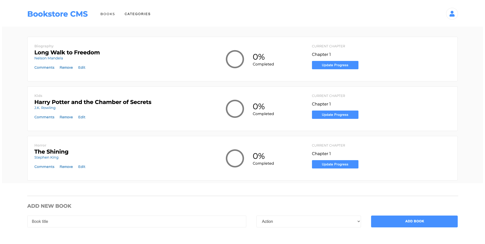

# Bookstore

In this project, I built a a website for a bookshop using React and Redux.

The purpose of this project was to practice and demonstrate my ability to create React components which are all connected to a single source of 'state': the Redux store object. In this particular project, the store contains information about the bookshop's current list of books, and also contains information about the category filter that is currently selected.

## Live Demo

To jump right into the project, visit the [Live Demo](https://buchmarkt.herokuapp.com/)!

## Built With

- **React** (bootstrapped using the [**create-react-app**](https://www.npmjs.com/package/create-react-app) template)
- **Redux**
- The **[react-redux](https://www.npmjs.com/package/react-redux)** package, which binds React components to Redux.
- **Sass** for styling.

## Local Setup

### Prerequisites

_**node.js is a pre-requisite of this project.**_

Don't have node.js? Choose a download method [here](https://nodejs.org/en/download/).

### Setup Instructions

To set this project up locally, follow these simple instructions:

1. Open a Terminal and navigate to the location in your system where you would like to download the project. **New to Terminal? [Learn here](https://www.freecodecamp.org/news/conquering-the-command-line-f85f5e46c07c/).**

2. Enter the following line of code to clone this repository:

`git clone git@github.com:Joseph-Burke/Bookstore.git`

3. Now that the repository has been cloned, navigate inside it using `cd Bookstore`.

4. The project's dependencies are managed by npm. The details of this project's dependencies can be found in `package.json`. The `create-react-app` template comes with some existing commands you can use to get the project going. To start, simply enter:

`npm start`

This will compile the .js and .scss files and open your browser so you can enjoy the website.

## Author

👤 **Joe Burke**

- Github: [@Joseph-Burke](https://github.com/Joseph-Burke)
- Twitter: [@__joeburke](https://twitter.com/__joeburke)
- Linkedin: [Joseph Burke](https://www.linkedin.com/in/--joeburke/)

## 🤝 Contributing

Contributions, issues and feature requests are always welcome!

Drop me a line through any of the channels listed above or head directly to the [issues page](issues/).

## Show your support

Hey! Give this project a ⭐️! It costs nothing but it buys a smile :)

## Acknowledgments

- This project was built as part of the Microverse Web Development course, which you can learn more about [here](https://www.microverse.org/).

## 📝 License

This project is [MIT](lic.url) licensed.